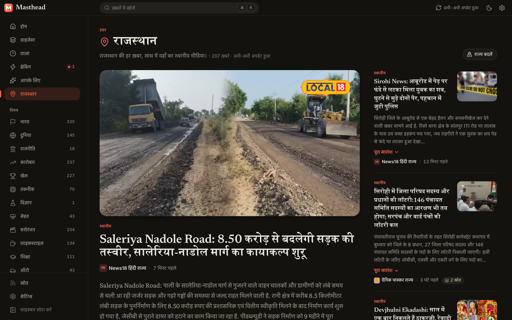

<div align="center">


# Masthead

**Alle Nachrichten. Ein ruhiger Ort.**

Eine schöne Desktop-App, die die Schlagzeilen der großen Redaktionen eines Landes zusammenführt —
und in der Sie sie werbefrei lesen, ohne die App je zu verlassen.
**Türkei · Vereinigte Staaten · Indien · Vereinigtes Königreich · Deutschland · Brasilien.**

[](https://github.com/ahmetcaglayan/masthead/releases/latest)
[](https://github.com/ahmetcaglayan/masthead/releases)
[](https://github.com/ahmetcaglayan/masthead/actions/workflows/ci.yml)
[](LICENSE)


[**Website**](https://ahmetcaglayan.github.io/masthead/) ·
[**0.3.0 herunterladen**](https://github.com/ahmetcaglayan/masthead/releases/latest) ·
[Changelog](CHANGELOG.md)

[English](README.md) · [Türkçe](README.tr.md) · **Deutsch** · [Português](README.pt.md)

</div>

<p align="center">
  
</p>

## Warum Masthead?

Nachrichten zu verfolgen heißt meist: ein Dutzend Browser-Tabs, Cookie-Banner, automatisch startende Videos und
Pop-ups. Masthead führt **532 Redaktionen aus sechs Ländern** — die Presse jedes Landes, in seiner eigenen Sprache —
auf einer ruhigen, magazinartigen Titelseite zusammen:

- **Dem Tagesgeschehen folgen, ohne zu klicken.** Auf jeder Karte die ganze Schlagzeile, eine Zusammenfassung und
  ein Foto — die Topmeldung bringt ihre Zusammenfassung vollständig, bei den übrigen steht am Ende
  „Ganze Zusammenfassung“. Der **Überblick** bündelt dieselbe Meldung aus verschiedenen Medien, sodass Sie auf
  einen Blick sehen, wer was berichtet hat.
- **An Ort und Stelle lesen — ohne Werbung.** Klicken Sie eine Meldung an, und sie öffnet sich in einem großen
  Dialogfenster in der App — standardmäßig im **Lesemodus**: der Artikel als Text, in Ihrer eigenen Leseschrift.
  Die Seite des Mediums ist im selben Fenster nur einen Klick entfernt; Werbung und Tracker bleiben blockiert.
  <kbd>Esc</kbd> drücken, und Sie sind zurück.
- **Eilmeldungen, Titelseite und ein Live-Feed.** Ein Laufband mit Eilmeldungen, eine Titelseite, deren
  Aufmacher aus den Meldungen entsteht, über die die meisten Medien berichten, und die Spalte „Neueste“,
  Minute für Minute.
- **Ihre Quellen, Ihre Regeln.** Schalten Sie jedes Medium ein oder aus. Filtern Sie nach Zeitraum, Quelle,
  Reihenfolge und Bild — und nach Region und Stadt, Bundesland oder Gebiet.
- **Regionales überall.** Wählen Sie Ihre Stadt in der Türkei, Ihren Bundesstaat in den USA, Brasilien oder Indien,
  Ihr Bundesland oder Ihr Gebiet im Vereinigten Königreich: Die Medien vor Ort kommen dazu, samt jeder
  überregionalen Meldung, die den Ort nennt.
- **Von Grund auf privat.** Kein Konto, keine Telemetrie. Einstellungen, gespeicherte Meldungen und der
  Leseverlauf bleiben auf Ihrem Rechner.

### Die Nachricht lesen, nicht die Werbung

Jede Meldung öffnet sich in Masthead, und der eingebaute Browser **blockiert Werbung und Tracker**
(auf EasyList-Basis, abschaltbar unter Einstellungen → Lesen). Keine Einwilligungsbanner, die um Ihre
Aufmerksamkeit kämpfen, kein automatisch startendes Video, kein Newsletter-Fenster über dem zweiten Absatz —
der Artikel so, wie die Redaktion ihn geschrieben hat. Das Blockieren bleibt der Desktop-App vorbehalten: In der
Browser-Version wird ein Artikel in einem Rahmen oder im Lesemodus gezeigt, und blockieren kann dort nur die
Seite des Mediums selbst.

**Meldungen öffnen sich im Lesemodus**: Schlagzeile, Autorenzeile und Text in Ihrer eigenen Leseschrift und
Schriftgröße, auf dem warmen Papier oder der tiefen Tinte der App. Dieselbe Meldung, kein Layout, keine Skripte.
Schalten Sie in der Symbolleiste auf **Web** um, wenn Sie die Seite des Mediums sehen möchten — oder machen Sie
„Webseite“ unter Einstellungen → Lesen wieder zum Standard. Downloads, Pop-ups und Berechtigungsanfragen von
Nachrichtenseiten werden abgelehnt, und der eingebaute Browser läuft in einer eigenen, abgeschotteten Sitzung,
getrennt von allem anderen.

### Eine Meldung, alle Medien

Dasselbe Ereignis wird selten zweimal gleich erzählt. Masthead bündelt die Meldungen, die verschiedene
Redaktionen zu einem Ereignis veröffentlichen, damit Sie eine Nachricht aus mehreren Blickwinkeln lesen können
statt nur durch ein einziges Medium hindurch:

- Auf der **Titelseite** zeigt die Topmeldung, wie viele Medien über sie berichten („8 Quellen“), und darunter
  stehen die eigenen Schlagzeilen der anderen Redaktionen.
- Die Seite **Überblick** ist dieser Gedanke, konsequent zu Ende gedacht: eine Karte je Ereignis, die
  ausführlichste Zusammenfassung oben und darunter die Schlagzeile jedes weiteren Mediums mit Logo und
  Veröffentlichungszeit — das ganze Tagesgeschehen, ohne einen einzigen Klick.
- In einem geöffneten Artikel zeigt **„Auch berichtet von“**, wer sonst noch über dasselbe Ereignis berichtet,
  sodass Sie mit einem Klick von der Version einer Redaktion zu der einer anderen springen — oder mit
  <kbd>Alt</kbd> + <kbd>←</kbd> / <kbd>→</kbd> durch die Meldungen des Tages blättern.
- Sortieren Sie jeden Feed nach **Am meisten berichtet**, dann stehen die Meldungen vorn, die viele Medien bringen.

## Screenshots

| | |
| --- | --- |
|  |  |
| **Überblick** — jede Meldung einmal, mit der Schlagzeile jedes Mediums | **An Ort und Stelle lesen** — die Seite des Mediums im Dialogfenster, <kbd>Esc</kbd> zum Schließen |
|  |  |
| **Lesemodus** — klarer Text in Ihrer gewählten Schrift | **Neueste** — eine Zeitleiste, Minute für Minute (türkische Oberfläche, dunkles Design) |
|  |  |
| **Erster Start** — ein paar kurze Fragen, dann sind Sie drin | **Einstellungen** — Designs, Akzentfarben, Schriften, Quellen |

## Sechs Länder, fünf Sprachen

Jedes Land wird über seine eigenen Redaktionen gelesen, in seiner eigenen Sprache, bis hinunter zum Lokalen: eine
Stadt in der Türkei, ein Bundesstaat in den USA, Brasilien oder Indien, ein Bundesland in Deutschland, ein Gebiet im
Vereinigten Königreich. Die Sprache der Oberfläche ist davon unabhängig: Lesen Sie brasilianische Zeitungen mit
deutscher Oberfläche, wenn Ihnen das lieber ist.

| | |
| --- | --- |
|  |  |
| 🇺🇸 **Vereinigte Staaten** — 52 überregionale Redaktionen, von NPR und der NYT bis Fox News und dem WSJ, dazu Lokales für jeden Bundesstaat | 🇬🇧 **Vereinigtes Königreich** — BBC, Guardian, Telegraph, Sky News, die FT… und BBC-Lokalnachrichten für 51 Gebiete |
|  |  |
| 🇩🇪 **Deutschland** — tagesschau, Spiegel, Zeit, FAZ, SZ… mit der Oberfläche auf Deutsch | 🇧🇷 **Brasilien** — der Überblick auf Portugiesisch: eine Karte, die Schlagzeile jedes Mediums |
|  |  |
| 🇮🇳 **Indien** — die Hindi-Presse (अमर उजाला, दैनिक भास्कर, आज तक, TV9 भारतवर्ष…) und die Seite „Regional“ für Ihren Bundesstaat | 📖 **Lesemodus** — der Artikel und sonst nichts, in Ihrer eigenen Leseschrift |


## Download

Die aktuelle Version gibt es auf der [Releases-Seite](https://github.com/ahmetcaglayan/masthead/releases/latest):

| Plattform | Datei |
| --- | --- |
| Windows (Installer, Intel/AMD) | `Masthead-x.y.z-win-x64.exe` |
| Windows (Installer, ARM) | `Masthead-x.y.z-win-arm64.exe` |
| Windows (portabel, ohne Installation) | `Masthead-x.y.z-portable.exe` |
| macOS (Apple Silicon / Intel) | `Masthead-x.y.z-arm64.dmg` / `Masthead-x.y.z-x64.dmg` |
| Linux | `Masthead-x.y.z-linux-x86_64.AppImage` / `.deb` |

**Einmal installieren, danach hält sich Masthead selbst aktuell.** Der Windows-Installer und das Linux-AppImage
suchen stündlich nach einer neuen Version, laden sie im Hintergrund und bitten dann um einen Neustart; die
portable exe, die macOS-App und das .deb melden, wenn eine neue Version da ist. Automatische Installation
abschalten: Einstellungen → Daten & Über.

> **Die Builds sind noch nicht signiert.**
> - Windows SmartScreen warnt beim ersten Start unter Umständen: Wählen Sie
>   **Weitere Informationen → Trotzdem ausführen**.
> - Ist die **Intelligente App-Steuerung** (Smart App Control) eingeschaltet (Windows 11 → Windows-Sicherheit →
>   App- und Browsersteuerung), blockiert Windows unsignierte Apps möglicherweise ganz, ohne die Option
>   „Trotzdem ausführen“. Nutzen Sie dann die Browser-Version unten oder bauen Sie die App aus dem Quellcode.
> - macOS: Klicken Sie die App beim ersten Mal mit der rechten Maustaste an und wählen Sie **Öffnen**.

### Sie dürfen nichts installieren? Dann im Browser

Die ganze App läuft auch in einem gewöhnlichen Browser auf Ihrem eigenen Rechner — praktisch auf einem
Arbeitsrechner, auf dem Software nicht installiert werden darf:

```bash
git clone https://github.com/ahmetcaglayan/masthead.git
cd masthead
npm install
npm run dev:web      # http://localhost:5173 öffnen
```

Im Browser öffnen sich Meldungen in einem eingebetteten Rahmen, wenn die Seite es erlaubt, und sonst im
Lesemodus (Browser verhindern bei den meisten Nachrichtenseiten das Einbetten; in der Desktop-App gibt es diese
Grenze nicht).

## Funktionen

| | |
| --- | --- |
| 📰 **Titelseite** | Ein Aufmacher, weitere Schlagzeilen, Abschnitte zu Ihren Interessen, die laufende Zeitleiste „Neueste“ |
| ⚡ **Eilmeldungen** | Laufband, eigene Seite, auf Wunsch Desktop-Benachrichtigungen |
| 🧭 **Überblick** | Meldungen über Medien hinweg gebündelt, mit der Schlagzeile jedes einzelnen — das Tagesgeschehen in einem Rutsch |
| 🔎 **Filter & Suche** | Zeitraum, Quellen, Sortierung nach „Am meisten berichtet“, nur mit Bild, Gelesene ausblenden — dazu Regionen und Städte, Bundesländer oder Gebiete in jedem Land; akzentunabhängige Suche |
| 📖 **Lesen in der App** | Seite des Mediums im Dialogfenster (<kbd>Esc</kbd> zum Schließen), Lesemodus, Werbung und Tracker blockieren |
| 📍 **Regionale Nachrichten** | 81 türkische Provinzen, 50 US-Bundesstaaten und D.C., 36 indische Bundesstaaten, 16 Bundesländer, 27 brasilianische Bundesstaaten, 51 britische Gebiete — Medien vor Ort und Meldungen, die den Ort nennen |
| 🗂️ **Quellen** | Jedes Medium ein- oder ausschalten; Zustand der Feeds auf einen Blick |
| 🔖 **Bibliothek** | Gespeicherte Meldungen und Leseverlauf, lokal abgelegt |
| 🎨 **Machen Sie es zu Ihrem** | Hell / dunkel / System, fünf Akzentfarben, zwölf Leseschriften, Schriftgröße, kompakte Ansicht |
| 🌍 **Länder** | Türkei, Vereinigte Staaten, Indien, Vereinigtes Königreich, Deutschland und Brasilien — in den Einstellungen wechseln |
| 🔄 **Automatische Updates** | Neue Versionen laden im Hintergrund; ein Klick startet sie |
| 💬 **Sprachen** | Oberfläche: English, Türkçe, Deutsch, Português und हिन्दी — die Nachrichten bleiben in ihrer eigenen Sprache |

## Quellen

Masthead bringt für jedes Land ein **Länderpaket** mit: eine kuratierte, politisch ausgewogene Auswahl an Medien —
öffentlich-rechtliche Sender, Nachrichtenagenturen, Tagespresse, unabhängige Medien sowie Titel aus Wirtschaft,
Sport, Technik, Gesundheit, Reise und Kultur — und die Regionalpresse des Landes. Jedes Medium schreibt in der
Sprache des Landes: Indien liest seine Hindi-Presse, Deutschland seine deutschen Redaktionen.

| Land | Quellen | Feeds |
| --- | --- | --- |
| 🇹🇷 Türkei | 136 (67 national + regional: Stadt-Feeds für alle 81 Provinzen, Zeitungen in 33 davon) | 536 |
| 🇺🇸 Vereinigte Staaten | 176 (52 überregional + 124 Lokalredaktionen, zwei bis drei in jedem Bundesstaat und D.C.) | 240 |
| 🇮🇳 Indien | 19, alle auf Hindi (15 überregional + die Bundesstaats-Seiten von vier Zeitungen, 17 Bundesstaaten) | 108 |
| 🇬🇧 Vereinigtes Königreich | 68 (29 überregional + BBC-Lokalnachrichten für 51 Gebiete und 38 Regionalzeitungen) | 161 |
| 🇩🇪 Deutschland | 75 (39 überregional + Regionales für alle 16 Bundesländer) | 157 |
| 🇧🇷 Brasilien | 58 (42 überregional + g1 für alle 27 Bundesstaaten und 15 Regionalzeitungen) | 130 |

Jeder Feed wird vor der Auslieferung an den echten Seiten überprüft (`npm run verify:feeds`). Die
vollständige Liste, den Aufbau der Länderpakete und die Anleitung, eine eigene Quelle oder ein eigenes Land
hinzuzufügen, finden Sie in [docs/SOURCES.md](docs/SOURCES.md).

Masthead zeigt nur die Schlagzeilen, Zusammenfassungen und Bilder, die die Medien in ihren öffentlichen
RSS-Feeds bereitstellen. Ganze Artikel werden immer auf der Seite des Mediums gelesen.

## Entwicklung

```bash
npm install
npm run dev          # Desktop-App mit Hot Reload
npm run dev:web      # Browser-Version unter http://localhost:5173
npm test             # Unit-Tests
npm run typecheck && npm run lint
npm run dist:win     # Windows-Installer und portable EXE nach release/ bauen
```

Gebaut mit Electron, React, TypeScript, Tailwind CSS und Vite. Das Backend (`src/core`) ist reines Node.js und
läuft sowohl in der Desktop-App als auch als Server hinter dem Web-Modus. Architektur und Roadmap stehen in
[docs/PLAN.md](docs/PLAN.md); wie Sie mitmachen können, in [CONTRIBUTING.md](CONTRIBUTING.md).

### In einem Netzwerk, das HTTPS aufbricht

In manchen Firmennetzen signiert ein Proxy jede HTTPS-Verbindung mit dem Stammzertifikat der Organisation neu.
Browser akzeptieren es über den Zertifikatspeicher des Systems, Node.js führt jedoch einen eigenen — deshalb
scheitert jeder Feed mit `SELF_SIGNED_CERT_IN_CHAIN`, und die App bleibt leer. Speichern Sie dieses
Stammzertifikat als PEM-Datei und geben Sie Node den Pfad dorthin mit:

```bash
NODE_EXTRA_CA_CERTS=/path/to/root-ca.pem npm run dev:web
```

Dieselbe Variable gilt für `npm run dev`: Artikel werden in einer eingebetteten Browser-Ansicht dargestellt, die
den Zertifikatspeicher des Systems nutzt; die Feeds holt jedoch Node.

## Datenschutz

Keine Konten, keine Analysedienste, kein Tracking. Die App verbindet sich nur mit den Nachrichtenseiten, die Sie
eingeschaltet haben, stündlich mit GitHub, um nach einer neuen Masthead-Version zu sehen — und, wenn Werbung und
Tracker blockiert werden, zum Laden öffentlicher Filterlisten. Siehe
[SECURITY.md](SECURITY.md).

## Lizenz

[MIT](LICENSE) © Ahmet Çağlayan. Die Nachrichteninhalte gehören den jeweiligen Medien.
