<div align="center">

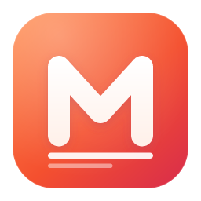

# Masthead

**All your news. One calm place.**

A beautiful desktop news reader that brings the headlines of a country's major newsrooms together —
and lets you read them, ad-free, without ever leaving the app.
**Türkiye · United States · India · United Kingdom · Germany · Brazil.**

[](https://github.com/ahmetcaglayan/masthead/releases/latest)
[](https://github.com/ahmetcaglayan/masthead/releases)
[](https://github.com/ahmetcaglayan/masthead/actions/workflows/ci.yml)
[](LICENSE)


**English** · [Türkçe](README.tr.md)

</div>

<p align="center">
  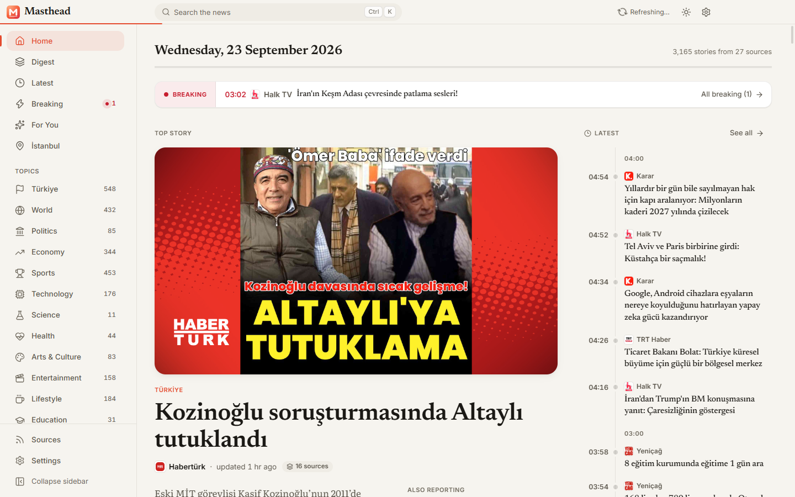
</p>

## Why Masthead?

Following the news usually means a dozen browser tabs, cookie banners, autoplaying videos and pop-ups.
Masthead gathers **206 newsrooms across six countries** into one calm, magazine-like front page:

- **Follow the agenda without clicking.** Full headlines, a summary and a photo on every card — the lead story
  carries its summary in full, the rest end with “Full summary”. The **Digest**
  groups the same story from different outlets, so you see who reported what at a glance.
- **Read in place, without the ads.** Click a story and it opens in a large dialog inside the app — in
  **Reader mode** by default: the article as text, in your own reading font. The publisher's page is one
  click away in the same dialog, with ads and trackers blocked. Press <kbd>Esc</kbd> and you're back.
- **Breaking news, front page and a live timeline.** A breaking-news ticker, a front-page hero built from
  the stories most outlets are covering, and a minute-by-minute "latest" column.
- **Your sources, your rules.** Turn any outlet on or off. Filter by time range, source, sort order and
  pictures — and, in Türkiye, by region and all 81 provinces.
- **Private by design.** No account, no telemetry. Settings, saved stories and history stay on your computer.

### Read the news, not the ads

Every story opens inside Masthead, and the embedded browser runs with **ad and tracker blocking** switched on
(EasyList-based, toggleable in Settings → Reading). No consent banners fighting for your attention, no
autoplaying video, no newsletter pop-up over the second paragraph — the article, the way the newsroom wrote it.
Ad blocking belongs to the desktop app: in the browser version an article is shown in a frame or in Reader mode,
and only the publisher's own page can block anything.

**Reader mode is what a story opens in**: headline, byline and body in your own reading font and size, on the
app's warm paper or deep-ink background. Same story, no layout, no scripts. Switch to **Web** in the toolbar
whenever you want the publisher's own page — or make Web the default again in Settings → Reading. Downloads, pop-ups and permission requests from news pages are refused,
and the embedded browser runs in its own sandboxed session, separate from everything else.

### One story, every outlet

The same event is rarely told the same way twice. Masthead clusters the stories that different newsrooms publish
about one event, so you can read around a story instead of through a single outlet:

- On the **front page**, the top story shows how many outlets are covering it ("8 sources") with the other
  newsrooms' own headlines underneath.
- The **Digest** page is that idea end to end: one card per event, the fullest summary at the top, and every
  other outlet's headline below it with its logo and the time it published — the whole day's agenda, no clicking.
- Inside an open article, **"Also covered by"** lists the same event elsewhere, so you can jump from one
  newsroom's version to another's in a click, or step through the day's stories with
  <kbd>Alt</kbd> + <kbd>←</kbd> / <kbd>→</kbd>.
- Sort any feed by **Most covered** to put the stories many outlets are running first.

## Screenshots

| | |
| --- | --- |
| 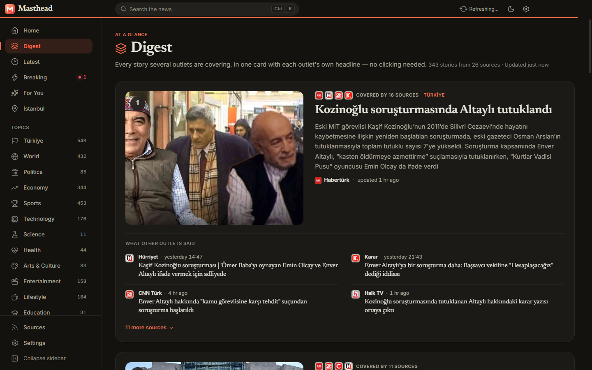 | 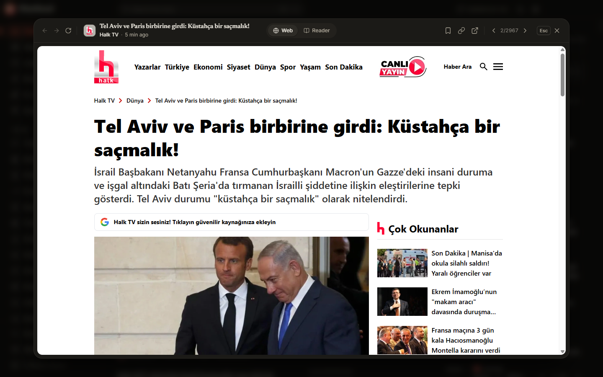 |
| **Digest** — each story once, with every outlet's headline | **Read in place** — the publisher's page in a dialog, <kbd>Esc</kbd> to close |
| 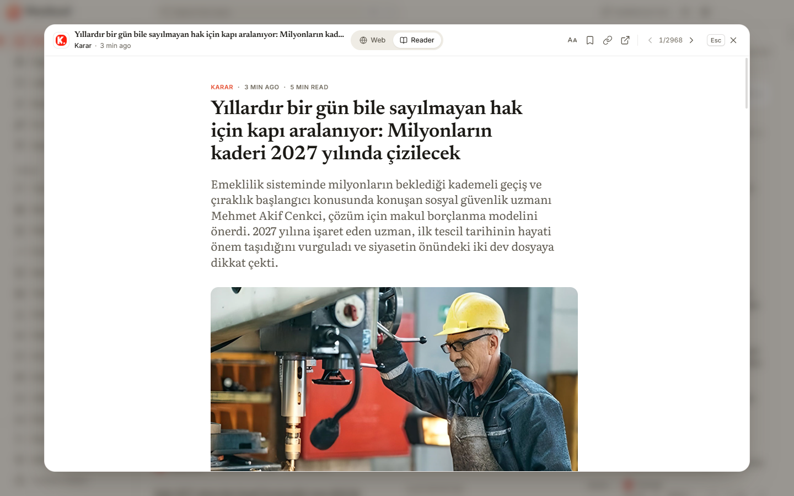 | 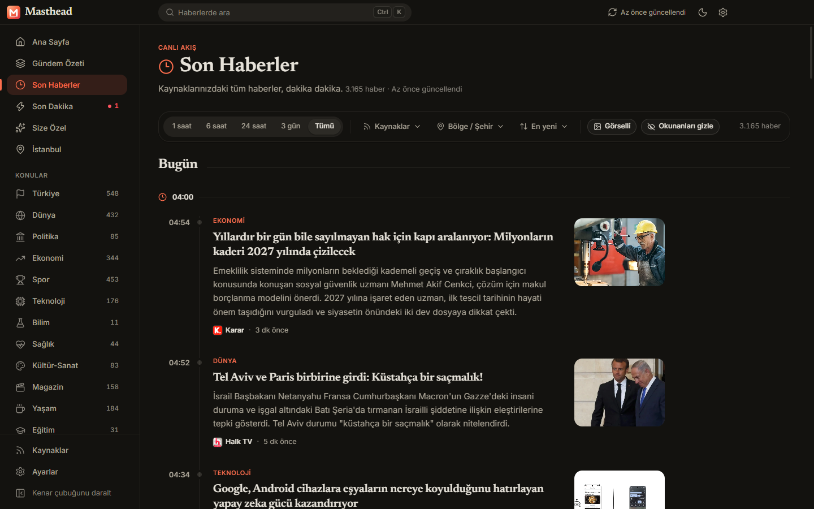 |
| **Reader mode** — clean text in your chosen font | **Latest** — a minute-by-minute timeline (Turkish UI, dark theme) |
| 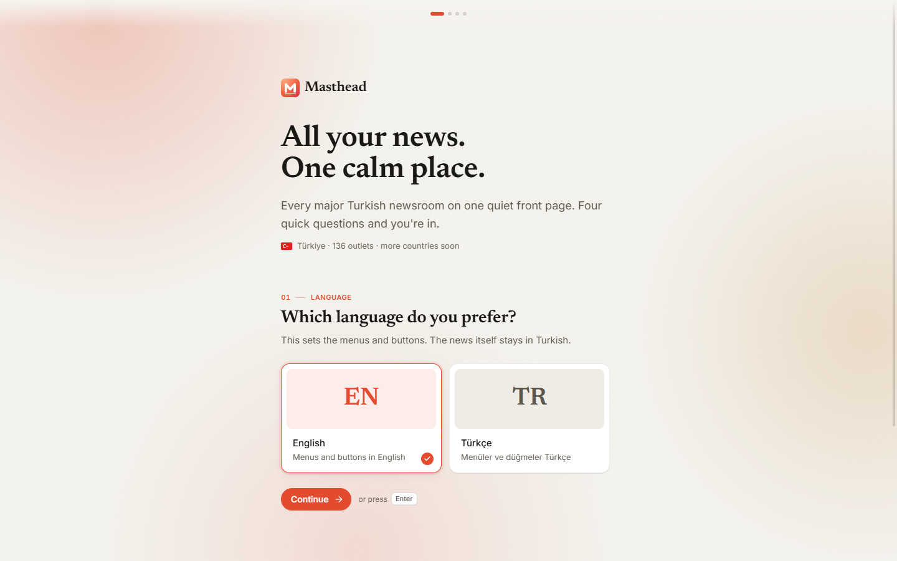 | 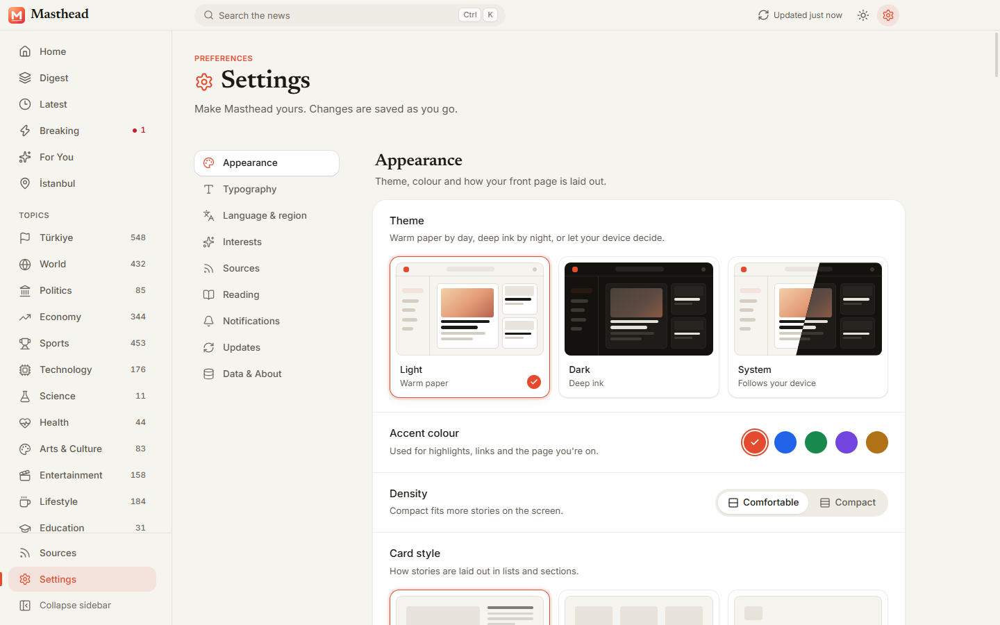 |
| **First run** — a few quick questions and you're in | **Settings** — themes, accent colours, fonts, sources |

## Six countries, four languages

The interface language and the language of the news are independent: read Brazilian newspapers with a German
interface if that is what you want.

| | |
| --- | --- |
| 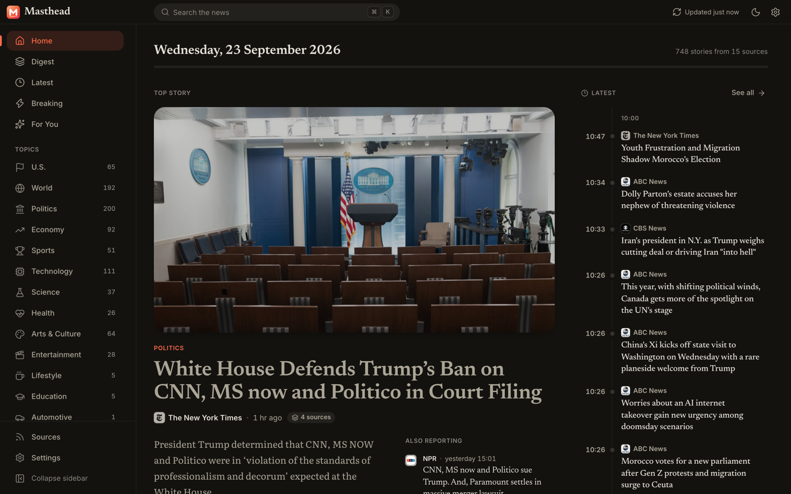 | 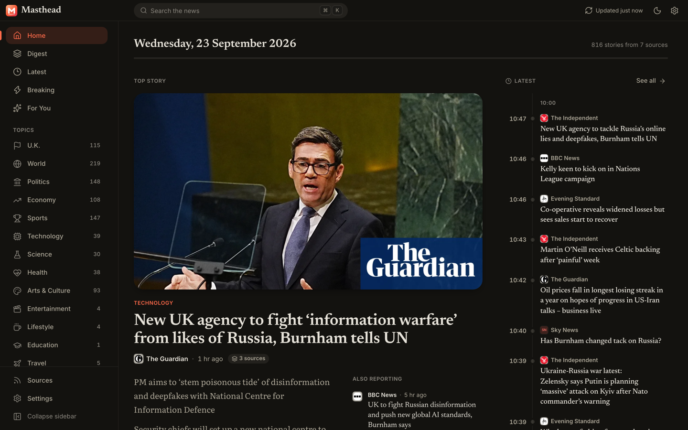 |
| 🇺🇸 **United States** — 18 newsrooms, from NPR and the NYT to Fox News and National Review | 🇬🇧 **United Kingdom** — BBC, Guardian, Sky News, the Independent, the FT |
|  | 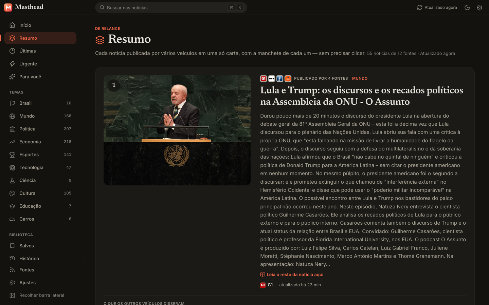 |
| 🇩🇪 **Germany** — tagesschau, Spiegel, Zeit, FAZ, SZ… with the interface in German | 🇧🇷 **Brazil** — the Digest in Portuguese: one card, every outlet's headline |
| 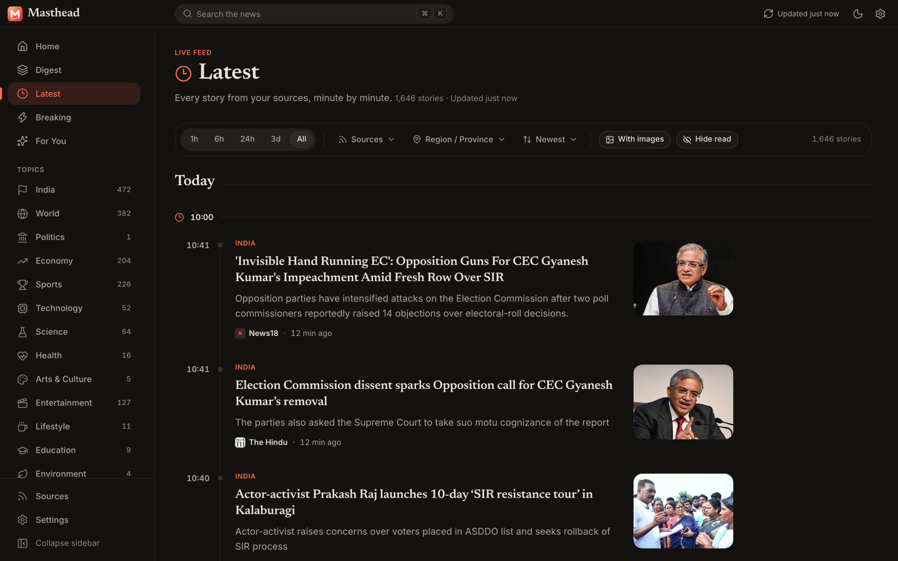 | 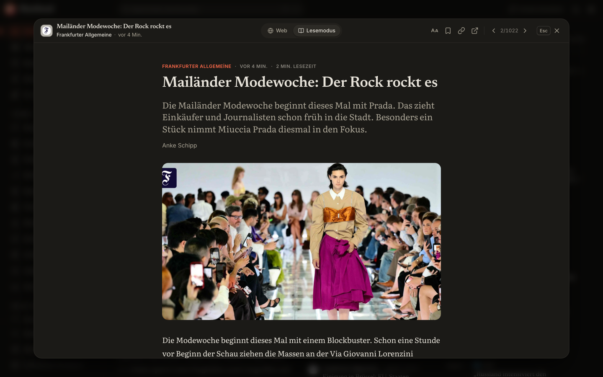 |
| 🇮🇳 **India** — the Latest timeline across TOI, The Hindu, HT, NDTV and more | 📖 **Reader mode** — the article and nothing else, in your own reading font |


## Download

Grab the latest version from the [Releases page](https://github.com/ahmetcaglayan/masthead/releases/latest):

| Platform | File |
| --- | --- |
| Windows (installer, Intel/AMD) | `Masthead-x.y.z-win-x64.exe` |
| Windows (installer, ARM) | `Masthead-x.y.z-win-arm64.exe` |
| Windows (portable, no install) | `Masthead-x.y.z-portable.exe` |
| macOS (Apple Silicon / Intel) | `Masthead-x.y.z-arm64.dmg` / `Masthead-x.y.z-x64.dmg` |
| Linux | `Masthead-x.y.z-linux-x86_64.AppImage` / `.deb` |

> **Builds are not code-signed yet.**
> - Windows SmartScreen may warn on first launch: choose **More info → Run anyway**.
> - If **Smart App Control** is on (Windows 11 → Windows Security → App & browser control), Windows may block
>   unsigned apps outright, without a "Run anyway" option. Use the browser version below, or build from source.
> - macOS: right-click the app and choose **Open** the first time.

### Can't install apps? Run it in your browser

The whole app also runs in a normal browser on your own machine — handy on a work computer where installing
software isn't allowed:

```bash
git clone https://github.com/ahmetcaglayan/masthead.git
cd masthead
npm install
npm run dev:web      # open http://localhost:5173
```

In the browser, stories open in an embedded frame when the site allows it and in Reader mode otherwise (browsers
block most news sites from being embedded; the desktop app has no such limit).

## Features

| | |
| --- | --- |
| 📰 **Front page** | A front-page hero, secondary headlines, sections for your interests, a live "latest" timeline |
| ⚡ **Breaking news** | Scrolling ticker, dedicated page, optional desktop notifications |
| 🧭 **Digest** | Stories grouped across outlets with every outlet's headline — the day's agenda in one scroll |
| 🔎 **Filters & search** | Time range, sources, most-covered sort, images only, hide read — plus 7 regions / 81 provinces in Türkiye; accent-insensitive search |
| 📖 **In-app reading** | Publisher's page in a dialog (<kbd>Esc</kbd> to close), Reader mode, ad & tracker blocking |
| 📍 **Local news** | Türkiye: pick your city for local papers and province-tagged stories |
| 🗂️ **Sources** | Switch each outlet on or off; feed health at a glance |
| 🔖 **Library** | Saved stories and reading history, stored locally |
| 🎨 **Make it yours** | Light / dark / system, five accent colours, twelve reading fonts, text size, compact mode |
| 🌍 **Countries** | Türkiye, the United States, India, the United Kingdom, Germany and Brazil — switch in Settings |
| 💬 **Languages** | English, Türkçe, Deutsch and Português interface; the news stays in its own language |

## Sources

Masthead ships a **country pack** per country: a curated, politically balanced set of outlets — public
broadcasters, news agencies, mainstream papers, independent media, plus business, sports and technology titles.

| Country | Sources | Feeds |
| --- | --- | --- |
| 🇹🇷 Türkiye | 136 (67 national + local: city feeds for all 81 provinces, papers in 33 of them) | 536 |
| 🇺🇸 United States | 18 | 49 |
| 🇮🇳 India | 10 | 37 |
| 🇬🇧 United Kingdom | 10 | 37 |
| 🇩🇪 Germany | 15 | 46 |
| 🇧🇷 Brazil | 17 | 34 |

Every feed is checked against the live sites before it ships (`npm run verify:feeds`). See
[docs/SOURCES.md](docs/SOURCES.md) for the full list, the country-pack layout and how to add a source or a
country of your own.

Masthead only shows headlines, summaries and images that publishers provide in their public RSS feeds. Full
articles are always read on the publisher's own page.

## Development

```bash
npm install
npm run dev          # desktop app with hot reload
npm run dev:web      # browser version at http://localhost:5173
npm test             # unit tests
npm run typecheck && npm run lint
npm run dist:win     # build the Windows installer and portable exe into release/
```

Built with Electron, React, TypeScript, Tailwind CSS and Vite. The backend (`src/core`) is plain Node.js and
runs both inside the desktop app and behind the web mode. Read [docs/PLAN.md](docs/PLAN.md) for the architecture
and roadmap and [CONTRIBUTING.md](CONTRIBUTING.md) to get involved.

### On a network that inspects HTTPS

On some company networks a proxy re-signs every HTTPS connection with the organisation's own root certificate.
Browsers accept it through the system trust store, but Node.js keeps its own — so every feed fails with
`SELF_SIGNED_CERT_IN_CHAIN` and the app stays empty. Save that root certificate as a PEM file and point Node at
it:

```bash
NODE_EXTRA_CA_CERTS=/path/to/root-ca.pem npm run dev:web
```

The same variable applies to `npm run dev`: articles render in an embedded browser view that uses the system
store, but the feeds are fetched by Node.

## Privacy

No accounts, no analytics, no tracking. The app only connects to the news sites you enable and, if ad blocking is
on, to download public filter lists. See [SECURITY.md](SECURITY.md).

## License

[MIT](LICENSE) © Ahmet Çağlayan. News content belongs to its respective publishers.
